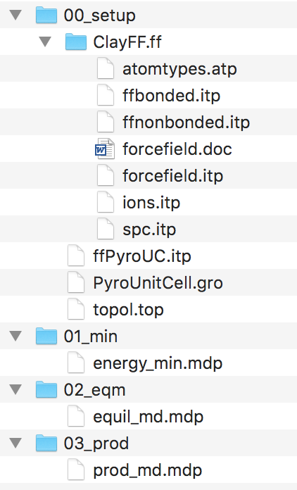
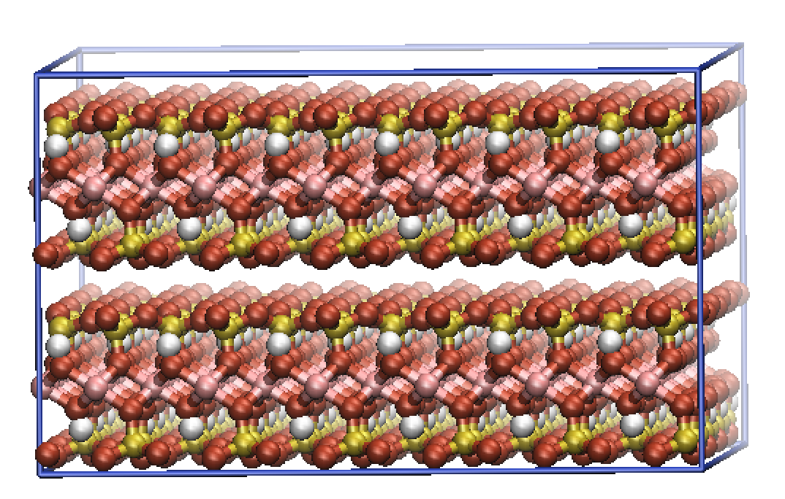
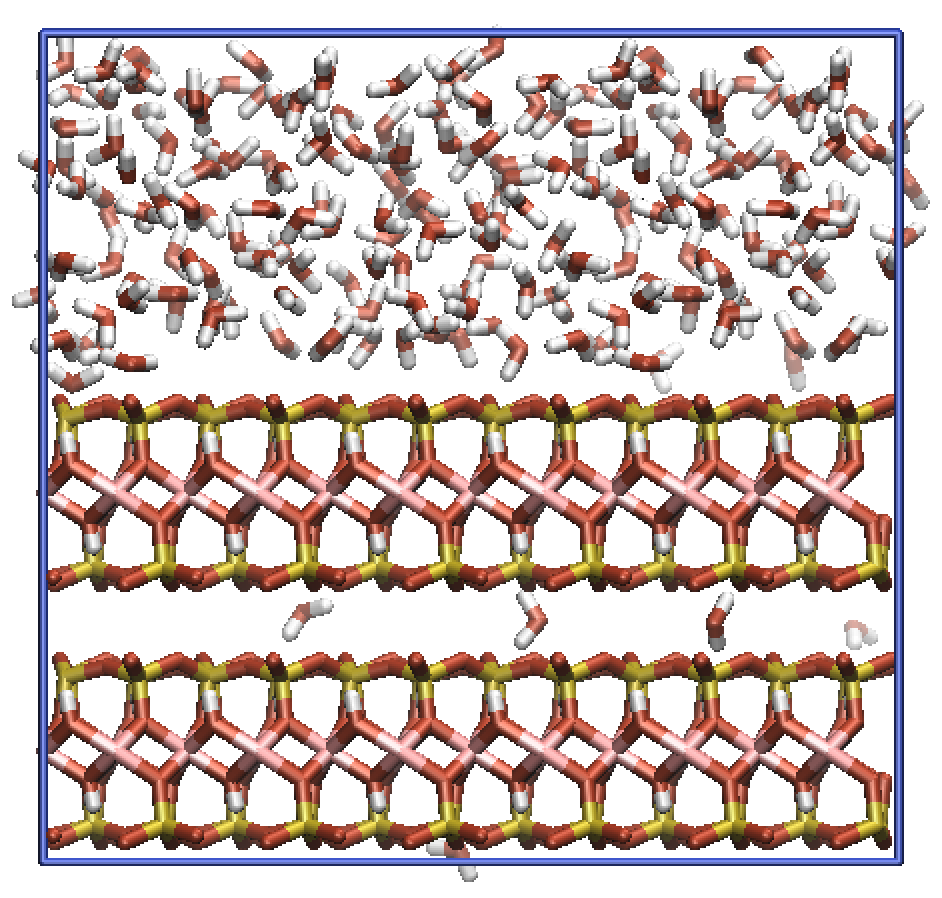
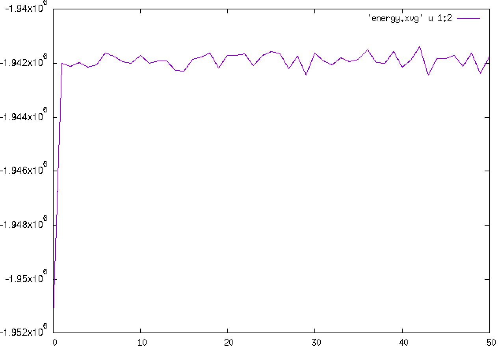
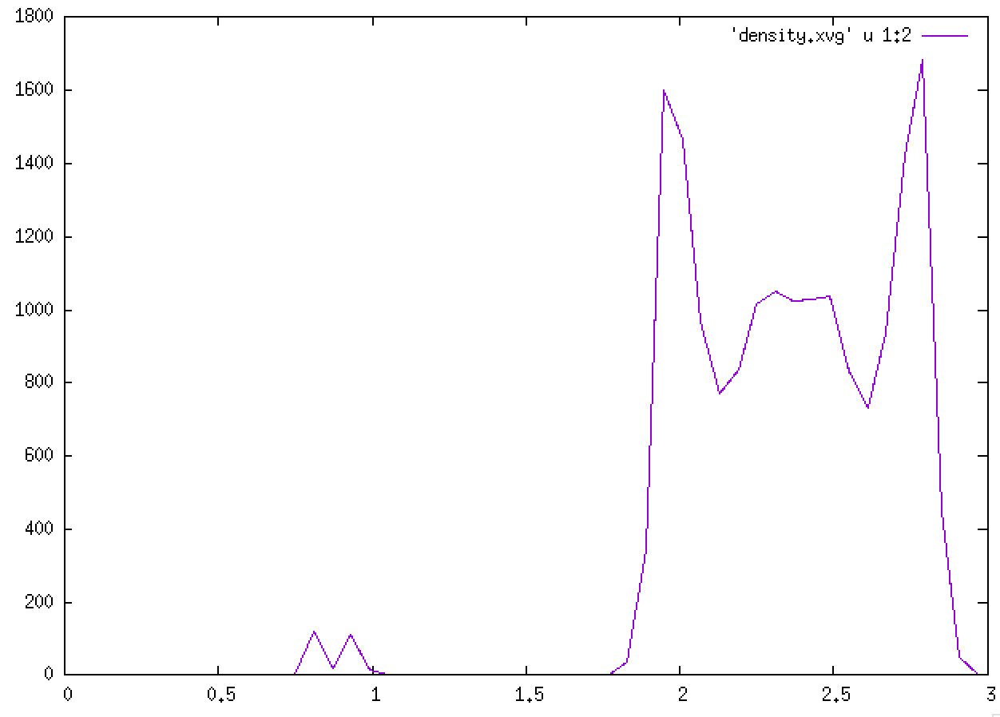

# ClayFF: 
# A GROMACS implementation of the ClayFF force field

## An old tutorial...

[GROMACS LINK:]

<http://www.gromacs.org>

[MDP OPTIONS (aka simulation settings):]

<http://manual.gromacs.org/online/mdp_opt.html>

[SUPER GOOD TUTORIALS (albeit, not mineral related):]

<http://www.bevanlab.biochem.vt.edu/Pages/Personal/justin/gmx-tutorials/index.html>

[BRIEF WORKTHROUGH OF USING GROMACS:]

1.  ***Files needed:***

    a.  A set of FF parameters (.ff Folder) -- Lots built into gromacs,
        but mainly bio related. See attachment for an example of ClayFF.

    b.  Structure file (.pdb/.gro).

    c.  Topology file (.top) -- links the structure file to FF folder.

    d.  Simulation settings input file (.mdp).

    e.  Jobscript.

2.  ***Installing gromacs on Ubuntu:***

Installing gromacs on Ubuntu should be fairly simple. Firstly, you
should update Ubuntu's package-manager (apt-get). You can think of
apt-get as a command-line driven app-store.

Run the commands:
```shell
sudo apt-get update
sudo apt-get upgrade
```

This should update the package-manager and then upgrade all default
installed packages in Ubuntu.

If you want to see what version of gromacs will be installed, as well as
all the requisite softwares that will be installed alongside gromacs,
run:
```shell
apt-cache show gromacs
```
Finally, to install gromacs you can run:
```shell
sudo apt-get install gromacs
```
N.B. be careful using the sudo command as it grants unlimited power!
It's very easy to break a machine by typing the wrong command into the
terminal with sudo.

Let's also install some other useful software from the command line.
```shell
sudo apt-get install grace
sudo apt-get install gnuplot
```
Grace is the default plotting tool used in conjunction with gromacs. I
personally prefer gnuplot, so I tend to install both.

You will need to install VMD by hand, as it has unusual licensing
issues.

Feel free to install any further software you like.

3.  ***Example Simulation:***

Within the attached archive you should find all the files required to
run a simple simulation of pyrophyllite (an uncharged clay mineral) with
water.

The files should contain the following...



One quirk of gromacs is that we need to run separate simulations for
energy minimization, equilibration and production.

This can be scripted once you are comfortable with the overall workflow,
but I still break my simulations down into smaller chunks in case
something goes wrong.

I tend to setup my simulation in the 00_setup folder and run all the
simulations in the subsequent folders.

Feel free to explore the files to try and understand how each file links
to one another.

First, open up a terminal in the 00_setup folder.

The PyroUnitCell.gro file is the unitcell of our mineral. We are
fortunate that ClayFF is almost entirely nonbonded. In this sense, we
can treat our unit cell like a single molecule and repeat it in xyz to
create a slab, without having to worry about bonds, angles and dihedrals
between adjacent unit cells.

This won't be the case with interface, so we'll need to think about how
to make the initial structures a bit better.

If you run the following command, you shall replicate the unit cell in
xyz to generate a slab structure.
```shell
gmx genconf --f PyroUnitCell.gro --nbox 6 4 2 --o slab.gro
```
You should now have a structure called slab.gro that is 6x4x2 unit
cells.



N.B. You can use the --h flag at the end of any gromacs command to find
more information about how the command works, its inputs and outputs,
etc... For example:
```shell
gmx genconf -h
```
You'll now need to amend the topology slightly to fix for the fact that
we have 48 unit cells in our structure, rather than just 1.

Open up the topol.top file and change the number 1 on the last line to
48.

Now let's add some water to the system.

Open up the slab.gro file and scroll down to the bottom.

The last three numbers are the {x,y,z} size of the overall simulation
structure. Edit the last number (z) to include some vacuum space.

For example, the last three numbers of my slab.gro file are now...
```
3.09600 3.58640 3.0000
```
Now run the command:
```shell
gmx solvate -cp slab.gro -cs spc216.gro -p topol.top -o solvated.gro
```
This will add SPC water molecules into the system. The spc216.gro file
is hidden in gromacs default libraries, there are other default solvents
you can use, but I forget what they are at the moment!

Note now that the topol.top file contains water molecules. In my case
391 water molecules.



Change directory to the 01_min folder and run the following command:
```shell
gmx grompp -f energy_min.mdp -c ../00_setup/solvated.gro -p ../00_setup/topol.top -maxwarn 1
```
Note that I had a slight mismatch in whitespace between atom naming's in
the structure file and the topology. This meant that I had to use the
--maxwarn 1 flag to ignore this warning. Always be sure to check what
the warnings mean before ignoring them, gromacs won't let you proceed
with un-ignored warnings.

The grompp command should have 'compiled' a binary .tpr file. This .tpr
file is the input to your simulation. The .tpr file contains all the
information about the system you wish to run. It is portable, so I
typically make my .tpr files on my local machine and then run the
simulation on a cluster.

To run the energy minimization, run the command:
```shell
gmx mdrun -s topol.tpr --v
```
gromacs should produce several files during the simulation.

The confout.gro file is the final structure of the energy minimization
process. This is the file that you should feed into equilibration MD.

The ener.edr is a binary file that contains all the information
regarding the energies of the system. This can be analysed using the gmx
energy command (see later).

The traj.trr file is the trajectory calculated by gromacs throughout the
simulation.

Next, change folder to the 02_eqm folder and run the following command.
```shell
gmx grompp -f equil_md.mdp -c ../01_min/confout.gro -p ../00_setup/topol.top
```
This shall now setup the equilibration MD run from our energy minimized
structure.

Again, run the following command to start the simulation:
```shell
gmx mdrun -s topol.tpr --v
```
Now that the simulation is complete, let us analyse some of the output
data:

The energies of the system can be analysed using the command:
```shell
gmx energy --f ener.edr
```
The 1d-density profiles of the system can be analysed using the command:
```shell
gmx density -f traj.trr
```
There is a tonne of other inbuilt analysis tools. To see them all, type:
```shell
gmx help commands
```
From here you would need to check for true equilibration before running
a production simulation. The process is exactly the same as running the
equilibration MD, but some of the setting in the input .mdp file are
slightly different.

I would now recommend exploring the .mdp files, seeing what each command
does. Also explore the potential options in the second link on the first
page. Finally, work through some of Justin's tutorials for a more
indepth understanding of how gromacs works from a bio points of view.



Plot of total energy against time \^



Density profile of water molecule in the system \^
